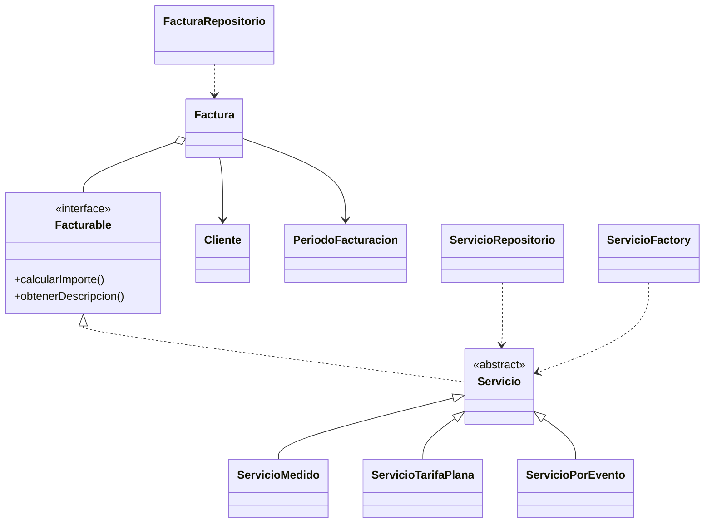

# Clases y persistencia - Caso F

Diagrama de estructura conceptual. Las clases de repositorio se encargan de las tablas; el dominio se mantiene desacoplado de la presentacion web.

| Clase | Tabla o responsabilidad |
| --- | --- |
| Cliente | clientes |
| Servicio y subclases | servicios, diferenciados por tipo |
| Factura | facturas y factura_detalles |
| PeriodoFacturacion | fecha_inicio y fecha_fin de facturas |
| ServicioRepositorio | lectura/escritura de servicios |
| FacturaRepositorio | lectura/escritura de facturas, detalles y clientes |
| ServicioFactory | reconstruccion polimorfica; no es una tabla |