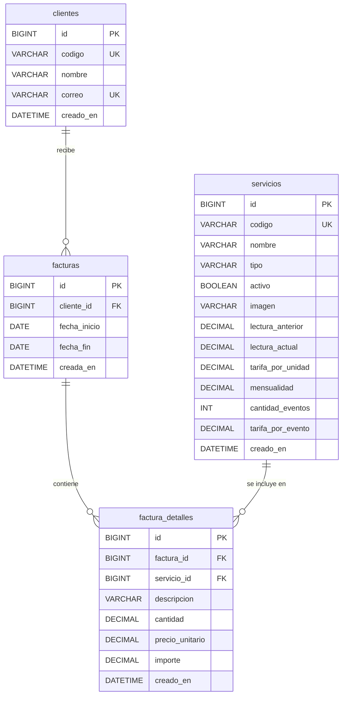

# Modelo relacional - Caso F, Fase 2

El diagrama representa las cuatro tablas de `database/schema.sql`. Los datos de factura se guardan en `factura_detalles` para conservar la descripcion, cantidad, precio y subtotal facturados.

Las relaciones son de uno a muchos desde clientes a facturas, desde facturas a factura_detalles y desde servicios a factura_detalles. La unicidad cliente-periodo esta definida en el SQL.